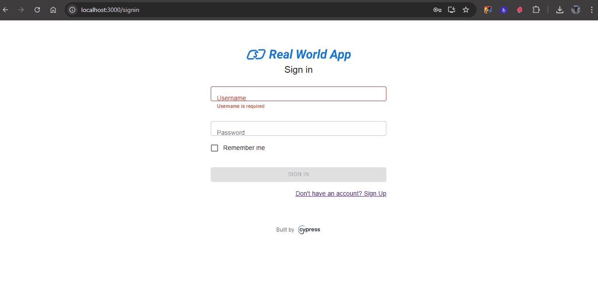

## 🐞 **Relatório de Bugs**

| **Campo** | **Descrição** |
|------------|----------------|
| **Software** | Real World App |
| **QA responsável** | Kaique Martins |
| **Data** | 03/11/2025 |

---

### **BUG01 – Erro ao realizar transferência com valor maior ou igual a zero**

| **Campo** | **Descrição** |
|------------|----------------|
| **ID** | BUG01 |
| **Descrição** | Ao realizar uma transferência com um valor maior do que o disponível em conta ou zerado, o sistema apresenta mensagem de **"Transaction Submitted!"** |
| **Severidade do Bug** | Alta |
| **Prioridade de correção** | Alta |
| **Status** | Em aberto |

---

### **🧩 Passos para reprodução do Bug**

1. Acessar a página de login  
2. Logar com usuário e senha cadastrados  
3. Clicar no botão **'New'** localizado no canto superior direito  
4. Selecionar um contato na lista  
5. Inserir um valor maior do que o disponível ou **zero (0)**  
6. Inserir uma descrição  
7. Clicar no botão **'Pay'**

---

### **✅ Resultado esperado**

Deve retornar uma mensagem de **saldo insuficiente** ou **valor inválido** (quando igual a zero).

---

### **❌ Resultado obtido**

O sistema apresenta mensagem de **"Transaction Submitted!"**

---

### **🧪 Ambiente**

- Ambiente de homologação  
- Windows 10  
- Google Chrome  

---

### **💰 Funcionalidade afetada**

Transferência de valores

---

### **🔗 Caso de teste relacionado**

**CT006 – Enviar dinheiro com saldo insuficiente**

---

### **📎 Evidência**

---

