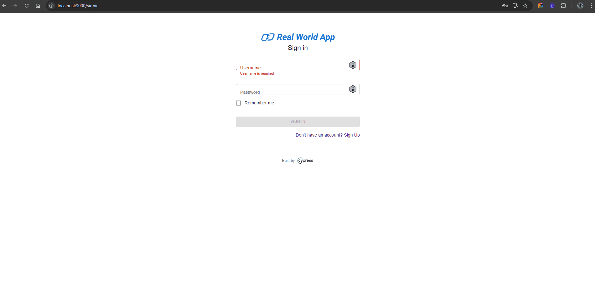

| **ID do Caso de Teste** | **CT001 - Login com sucesso** |
|--------------------------|--------------------------------|
| **Descrição** | Verifique se é possível fazer login com usuário válido, inserindo as informações corretas. |
| **Pré-condições** | Usuário precisa ter acesso ao sistema. |
| **Passo a passo** | 1. Acessar o endereço `http://localhost:3000/signin` 2. Inserir usuário cadastrado 3. Inserir uma senha válida 4. Clicar no botão **Sign in** |
| **Resultado esperado** | Usuário conecta com sucesso. Usuário redirecionado para a home page. |
| **Suíte de teste** | Tela de login |
| **Ambiente de teste** | Web - Navegador Google Chrome Versão 138.0.7204.168 (Versão oficial) |
| **Resultado encontrado** | O mesmo que o resultado esperado |
| **Status** | ✅ Passou |
| **Evidência** |  |

