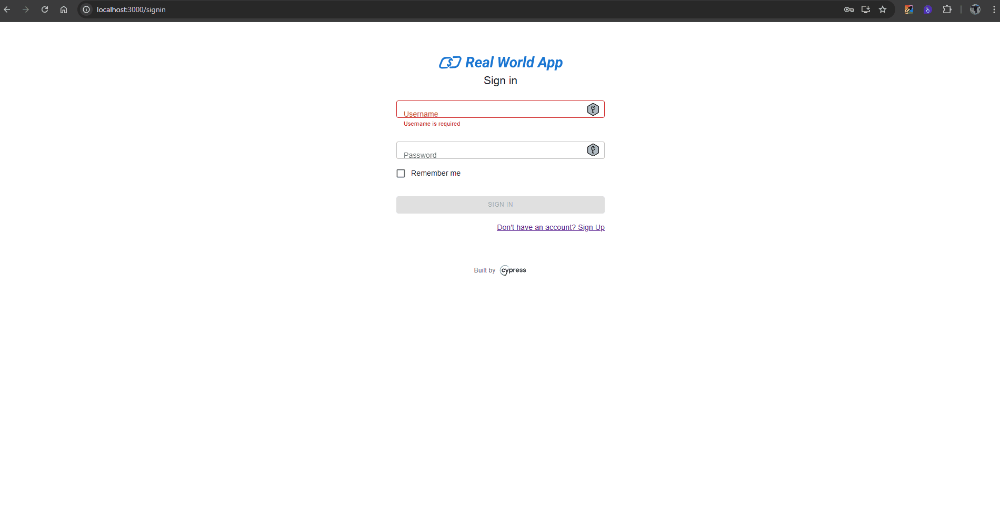

| **ID do Caso de Teste** | **CT002 - Login com credenciais inválidas** |
|--------------------------|---------------------------------------------|
| **Descrição** | Garanta que o sistema exiba uma mensagem de erro ao tentar fazer login com credenciais inválidas (email ou senha incorretos). |
| **Pré-condições** | Usuário não tem acesso ao sistema. |
| **Passo a passo** | 1. Acessar o endereço `http://localhost:3000/signin` 2. Inserir usuário não cadastrado 3. Inserir uma senha inválida 4. Clicar no botão **Sign in** |
| **Resultado esperado** | Mensagem de erro é exibida. Deve ser apresentada a mensagem: **"Username or password is invalid"** |
| **Suíte de teste** | Tela de login |
| **Ambiente de teste** | Web - Navegador Google Chrome Versão 138.0.7204.168 (Versão oficial) |
| **Resultado encontrado** | O mesmo que o resultado esperado |
| **Status** | ✅ Passou |
| **Evidência** |  |