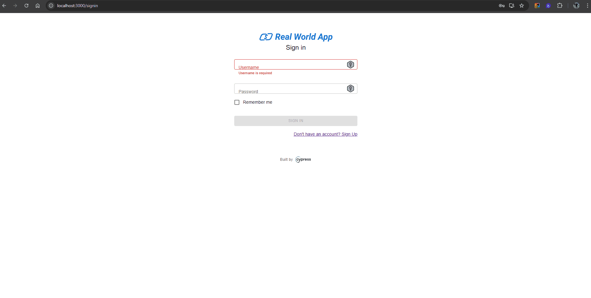

| **ID do Caso de Teste** | **CT004 - Registrar um novo usuário com informações incompletas** |
|--------------------------|------------------------------------------------------------------|
| **Descrição** | Garanta que o sistema exiba mensagens de erro ao tentar registrar um novo usuário sem preencher todas as informações obrigatórias. |
| **Pré-condições** | Usuário não tem acesso ao sistema. |
| **Passo a passo** | 1. Acessar o endereço `http://localhost:3000/signin` 2. Clicar no link **"Don't have an account? Sign Up"** 3. Cadastrar um novo usuário preenchendo os campos **First Name / Username / Password / Confirm Password **, mas deixando o campo **Last Name** em branco 4. Clicar no botão **Sign up** |
| **Resultado esperado** | Mensagem de erro é exibida. Deve ser exibida mensagem de erro. |
| **Suíte de teste** | Tela de cadastro |
| **Ambiente de teste** | Web - Navegador Google Chrome Versão 138.0.7204.168 (Versão oficial) |
| **Resultado encontrado** | No campo que ficou em branco **(Neste caso o campo Last Name)** é apresentada a seguinte mensagem de erro **Last Name is required** e o botão **Sign Up** fica bloqueado. |
| **Status** | ✅ Passou |
| **Evidência** |  |