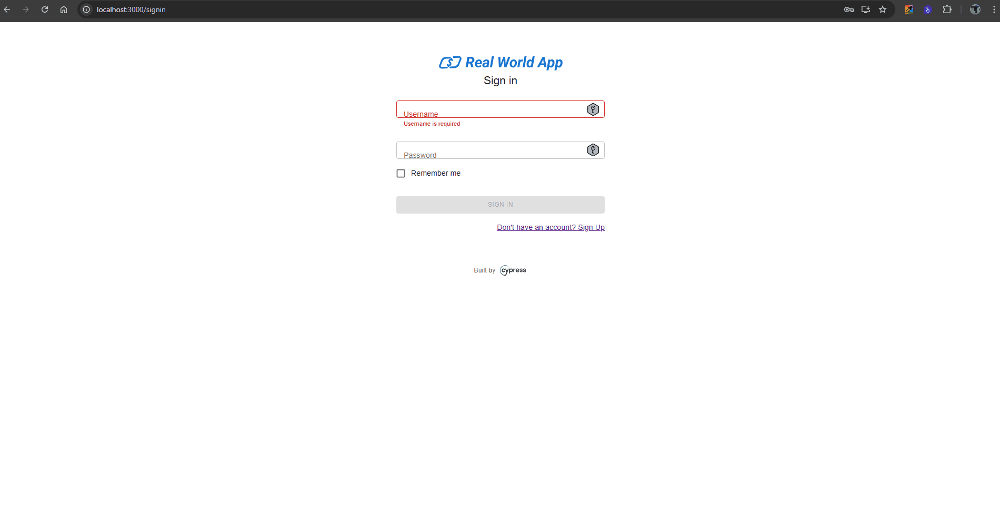

| **ID do Caso de Teste** | **CT006 - Enviar dinheiro com saldo insuficiente** |
|--------------------------|----------------------------------------------------|
| **Descrição** | Garanta que o sistema exiba uma mensagem de erro ao tentar enviar dinheiro sem saldo suficiente. |
| **Pré-condições** | Usuário precisa ter acesso ao sistema. |
| **Passo a passo** | 1. Acessar o endereço `http://localhost:3000/signin` 2. Inserir usuário não cadastrado 3. Inserir uma senha inválida 4. Clicar no botão **Sign in** 5. Clicar no botão **New** 6. Selecionar um contato 7. Selecionar um valor maior do que o saldo disponível 8. Inserir uma mensagem 9. Clicar no botão **Pay** |
| **Resultado esperado** | Mensagem de erro é exibida. Deve ser apresentada uma mensagem de **saldo insuficiente**. |
| **Suíte de teste** | Tela de pagamento |
| **Ambiente de teste** | Web - Navegador Google Chrome Versão 138.0.7204.168 (Versão oficial) |
| **Resultado encontrado** | Mensagem: **"Transaction Submitted!"** e o saldo fica zerado. |
| **Status** | ❌ Falhou |
| **Evidência** |  |