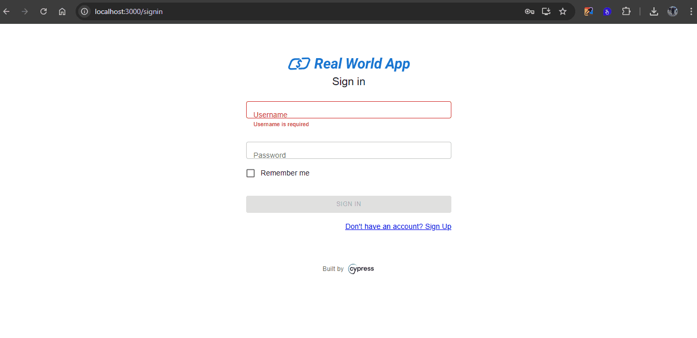

| **ID do Caso de Teste** | **CT007 - Visualizar histórico de transações com sucesso** |
|--------------------------|------------------------------------------------------------|
| **Descrição** | Verifique se é possível visualizar o histórico de transações de um usuário com suas transações anteriores exibidas corretamente. |
| **Pré-condições** | Usuário precisa ter acesso ao sistema. |
| **Passo a passo** | 1. Acessar o endereço `http://localhost:3000/signin` 2. Inserir usuário cadastrado 3. Inserir uma senha válida 4. Clicar no botão **Sign in** 5. Clicar na opção **Mine** 6. Validar se está na página **Personal** 7. Visualizar as transações |
| **Resultado esperado** | Transações visualizadas corretamente. |
| **Suíte de teste** | Tela de transações |
| **Ambiente de teste** | Web - Navegador Google Chrome Versão 138.0.7204.168 (Versão oficial) |
| **Resultado encontrado** | O mesmo que o resultado esperado |
| **Status** | ✅ Passou |
| **Evidência** |  |