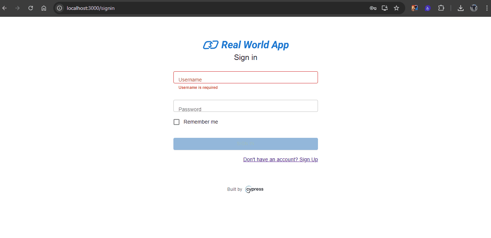

| **ID do Caso de Teste** | **CT008 – Tentar visualizar o histórico de transações de um usuário sem transações anteriores** |
|--------------------------|------------------------------------------------------------|
| **Descrição** | Garanta que o sistema exiba uma mensagem indicando que o usuário não possui transações anteriores caso tente visualizar o histórico sem transações registradas. |
| **Pré-condições** | Usuário precisa ter acesso ao sistema |
| **Passo a passo** | 1 - Acessar o endereço http://localhost:3000/signin   2 - Inserir usuário não cadastrado   3 - Inserir uma senha inválida   4 - Clicar no botão 'Sign in'   5 - Clicar na opção 'Mine'   6 - Validar se está na página 'Personal'   7 - Visualizar a mensagem "No Transactions" |
| **Resultado esperado** | Mensagem é exibida   Sistema deve apresentar a mensagem "No Transactions" |
| **Suíte de teste** | Tela de transações |
| **Ambiente de teste** | Web - Navegador Google Chrome Versão 138.0.7204.168 (Versão oficial) |
| **Resultado encontrado** | O mesmo que o resultado esperado |
| **Status** | ✅ Passou |
| **Evidência** |  |

